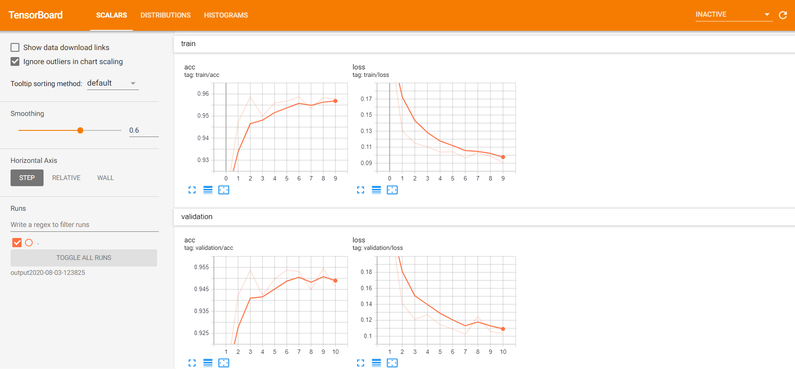
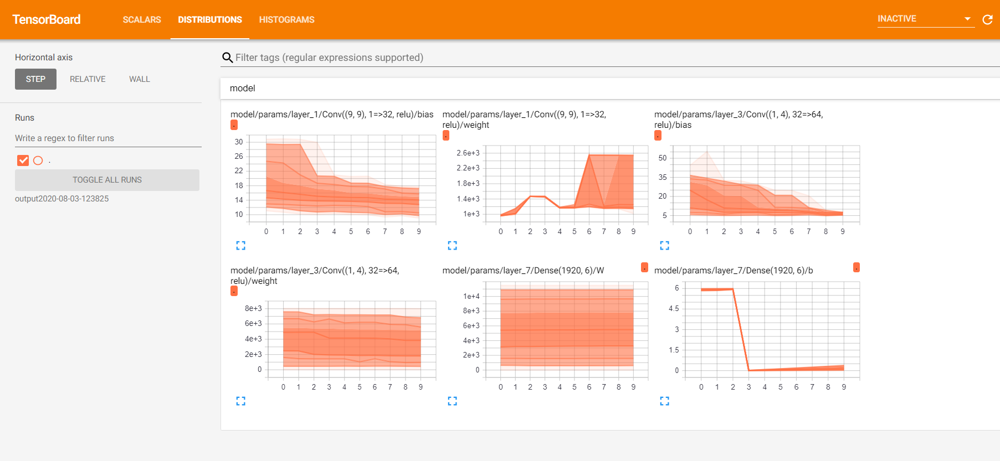

# OneDConv.jl
## Overview

This example demonstrates the use of a 1-dimensional convolutional neural network (CNN) to classify human activity from time-resolved data using Julia and the Flux machine learning library.  The data are from the Human Activity Recognition (HAR) Using Smartphone Dataset from the study described in the paper:
> Davide Anguita, Alessandro Ghio, Luca Oneto, Xavier Parra and Jorge L. Reyes-Ortiz. Human Activity Recognition on Smartphones using a Multiclass Hardware-Friendly Support Vector Machine. International Workshop of Ambient Assisted Living (IWAAL 2012). Vitoria-Gasteiz, Spain. Dec 2012

Data were collected on an experimental group performing six activities (walking, walking upstairs,walking downstairs, sitting, standing, and laying) while wearing smartphones.  The captured sensor signals were used to create a dataset of tri-axial linear acceleration
and tri-axial angular velocity measurements.  The processed dataset is available from the UCI Machine Learning Repository [here](https://archive.ics.uci.edu/ml/datasets/human+activity+recognition+using+smartphones), although
it is provided with this example for convenience.

## Data

The dataset consists of a training and a testing set.  The training set contains 7,352 examples of the 9 features (3-axis linear acceleration, 3-axis estimated body acceleration, and 3-axis angular velocity) in 
128-time step sequences.  Each feature is stored as an individual file, so the dataset consists of 9 files.  This example includes tools to aggregate the data into the format needed by the 
CNN model.

## Motivation

The motivating idea behind using a CNN on sequence data is analogous to its implementation in the context of image recognition.  The convolution operation can abstract away from the raw input
and express the data in feature maps that richly represent the activity types.  These feature maps can greatly enhance the representational power of the model.  By setting the kernel height to encompass all features with no vertical padding, the convolution operation is constrained to operate along the temporal axis, thereby capturing the sequential and dynamic structure of the data.

## Methodological Notes

In this example, the data are structured as a 4th-order tensor of ***features*** x ***time steps*** x ***channels*** x ***examples***, so each input example is of dimension **9** x **128** x **1**. The kernels convolve over the time dimension and produce feature maps along the channel dimension.  Data augmentation is used as a regularizer, by means of random Gaussian noise.

Train/test split and various other parameters can be adjusted via an arguments struct.

Training data can be logged using
TensorBoardLogger to facilitate diagnostics using Tensorboard.  This feature is on by default and can be changed in the arguments struct.

## Usage

### Setup

Run `julia deps/build.jl` to activate the project and install all dependencies.

### Running the demo

From the REPL, load the project.

`include("src/OneDCNN.jl")`
`using .OneDCNN`

Arguments are in an `Args` struct defined in OneDCNN.jl.  When loaded, the `args` object is created and arguments can be adjusted.  For example, to change the number of epochs from 10 (the default) to 20, use

`args.epochs = 20`.

The demo itself can be run by 

`train(args)`.

The data will be automatically loaded and transformed, training executed, and (provided `args.save_model` remains set to `true`) save the best-performing model to an output directory,
and (provided `args.tblogging` remains set to `true`) log model parameters and performance data on a per-epoch basis to a Tensorboard log file.

The logged data can be visualized by running the following command (assuming you have installed Tensorboard via pip):
```
tensorboard --logdir [path to output directory]

#example

tensorboard --logdir output1
```
The resulting output in your web browser will be similar to this.




Testing data is provided in the data directory, and the saved model can be used to run the test.

## Results

You should be able to achieve at or above 95% accuracy in 10 epochs using the demo code and default arguments.
